# SAÉ304 - Déployer un service de téléphonie multi-sites

*La dernière version de ce sujet de SAÉ est disponible sur le lien GitHub suivant : [SAE304](https://github.com/MichelBaie/SAE304)*

**Rédigé par :** Jack-Alexander CORRÊA DO CARMO et Tristan BRINGUIER

**Sujet initial :** Mr. Mohamed Amine Ouamri et Mme. Yamina Amzal

**Contexte :** Réalisé dans le cadre de la deuxième année  de BUT Réseaux et Télécommunications, parcours Réseaux Opérateurs  Multimédia à l’IUT de Villetaneuse

# Table des matières

1. [SAE304 - Déployer un service de téléphonie multi-sites](#sae304---d%C3%A9ployer-un-service-de-t%C3%A9l%C3%A9phonie-multi-sites)
2. [Introduction](#introduction)
3. [Pré-requis](#pr%C3%A9-requis)
4. [Infrastructure déployée](#infrastructure-d%C3%A9ploy%C3%A9e)
5. [Configuration réseau des machines virtuelles](#configuration-r%C3%A9seau-des-machines-virtuelles)
6. [Configuration du Site A (3CX)](#configuration-du-site-a-3cx)
   1. [Configuration du DHCP](#configuration-du-dhcp)
   2. [Configuration du DNS](#configuration-du-dns)
   3. [Configuration du serveur 3CX](#configuration-du-serveur-3cx)
   4. [Ajout d’extensions](#ajout-dextensions)
   5. [Configuration du Softphone](#configuration-du-softphone)
   6. [Configuration d’un Yealink T42U](#configuration-dun-yealink-t42u)
7. [Configuration du Site B (FreePBX)](#configuration-du-site-b-freepbx)
   1. [Configuration du DHCP - DNS](#configuration-du-dhcp---dns)
   2. [Installation de FreePBX](#installation-de-freepbx)
   3. [Configuration initiale de FreePBX](#configuration-initiale-de-freepbx)
   4. [Création des lignes SIP](#cr%C3%A9ation-des-lignes-sip)
   5. [Connexion d’un client SIP (Softphone Linphone)](#connexion-dun-client-sip-softphone-linphone)
   6. [Connexion d’un téléphone Yealink T42U](#connexion-dun-t%C3%A9l%C3%A9phone-yealink-t42u)
8. [Configuration des pare-feux Stormshield](#configuration-des-pare-feux-stormshield)
9. [Configuration des trunks SIP](#configuration-des-trunks-sip)
   1. [Trunk sur 3CX](#trunk-sur-3cx)
   2. [Trunk sur FreePBX](#trunk-sur-freepbx)
10. [BONUS : Approfondissement des fonctionnalités](#bonus--approfondissement-des-fonctionnalit%C3%A9s)
    1. [SVI](#svi)
    2. [Groupements d’appels](#groupements-dappels)
    3. [Client Web](#client-web)

## Introduction

Cette SAÉ présente le déploiement d'un service de téléphonie multi-sites dans le cadre de notre formation en Réseaux et Télécommunications. L'objectif est de configurer et de déployer une infrastructure téléphonique interconnectée entre deux sites, en utilisant des solutions comme 3CX et FreePBX, tout en assurant la gestion des réseaux, du DHCP, du DNS, et des équipements tels que les téléphones Yealink et les softphones.

## Pré-requis

- **VMware Workstation Pro** : Pour créer et gérer les machines virtuelles. VMWare est désormais gratuit pour les particuliers et étudiants. Il intègre automatiquement les outils invités permettant le redimensionnement automatique de l'écran et la gestion simplifiée du presse-papier. Les installateurs pour Linux ou Windows sont disponibles sur le [CDN de VMWare](https://softwareupdate.vmware.com/cds/vmw-desktop/ws/)

## Infrastructure déployée 


Cette infrastructure représente une interconnexion entre **deux sites différents** chacun séparés par un **pare-feu Stormshield**.

Nous n’allons pas reproduire physiquement cette infrastructure.

Sur **VMware**, nous reproduisons cette infrastructure avec cette liste de **VM (Virtual Machines / Machines virtuelles)**.


## Configuration réseau des machines virtuelles

Pour virtualiser tout cela, nous allons d’abord définir sur **VMWare** les différents réseaux.

 

Cliquer sur **Change Settings** pour pouvoir modifier les réseaux internes à **VMWare**.

Via le bouton **Add Network **(et **Rename Network** pour les renommer à souhait), créer **4 réseaux** :

- **LAN_SiteA** : Le réseau **LAN** dédié au **Site A**
- **LAN_SiteB** :  Le réseau **LAN** dédié au **Site B**
- **LAN_Switch** : Le réseau qui permettra de faire le lien entre une machine de **l’IUT** et un **switch **physique (utilisé par la suite pour faire fonctionner des téléphones physiques **Yealink T42U**).
- **WAN** : Le réseau **WAN** qui représentera **Internet** (entre les deux **pare-feux Stormshield**).


Pensez à bien désactiver le service **DHCP** (nous en déploierons un par site.). Spécifiez également l’adresse du réseau sur chaque **LAN**.


Pour le **LAN_Switch**, spécifiez le réseau en **Bridged** vers l’interface réseau de votre **PC** qui sera branché sur le **switch**.

Maintenant que tous les réseaux sont configurés, <u>il faut les ajouter sur les **machines virtuelles (VM)**</u>.

#### Exemple sur la VM Stormshield Site A


Ici, nous aurons une interface dans le réseau **WAN** et l’autre dans le **LAN_SiteA**.

## Configuration du Site A (3CX)

>  [!CAUTION]
>
> Ne démarrez pas encore la machine **3CX**.

### Configuration du DHCP

Nous allons d’abord procéder à la configuration du serveur **DHCP**.

>  [!TIP]
>
> Aller dans **VM -> Send Ctrl+Alt+Del** pour déverrouiller la **VM**.
>
> 

>  [!NOTE]
>
> Le mot de passe est **Admin01!**

Sur la VM **DHCP_DNS_SiteA**, cliquer sur **Ajouter des rôles et des fonctionnalités**.

L

Tout laisser par défaut jusqu’à **Rôles de serveurs** puis sélectionner les deux fonctionnalités **Serveur DHCP** et **Serveur DNS**.


Cliquer sur **Suivant** et laisser toutes les options par défaut.


>  [!NOTE]
>
> Si demandé, cliquer sur Finaliser la configuration **DHCP** à partir de ce menu :

Nous allons maintenant configurer le service **DHCP** : 


Cliquer droit sur **IPv4** et sélectionner **Nouvelle étendue**
Cela nous permettra de créer une **pool DHCP**.


Donnez un nom à l’étendue (p. ex: **sitea.local**) : 


Attribuez la plage d’adresse **192.168.1.100 -> 192.168.1.200**. Le masque sera **255.255.255.0 (/24 CIDR)**

 

Nous allons configurer dès maintenant les **options DHCP**.

- **Routeur (passerelle par défaut) : <u>192.168.1.1</u>**

  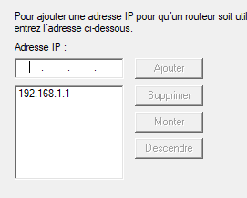

  > [!CAUTION]
  >
  > Attention à bien cliquer sur **Ajouter** pour que l’entrée soit enregistrée.

- **Domaine parent : <u>sitea.local</u>**

- **Adresse IP du serveur DNS : <u>192.168.1.20</u>**

  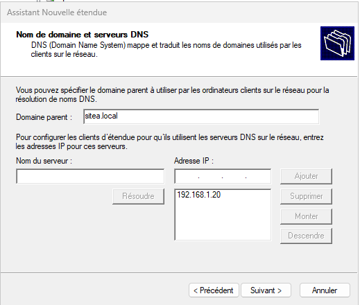

Activer **l’étendue**.

En général, il est peu pratique qu’un **routeur/pare-feu** ou qu’un quelconque **serveur** possède une adresse IP qui varie dans le temps. Pour pallier à ce souci, nous allons **réserver** une adresse IP au **pare-feu** et au **serveur 3CX**.

Sur la **VM Stormshield** et la **VM 3CX**, allez dans les paramètres réseau et recueillir **l’adresse MAC** de chaque interface **<u>dans le réseau LAN_SiteA</u>**.


Pour créer la réservation, cliquer sur **Nouvelle réservation** sur l’onglet **Réservations** :


Renseignez le nom de la réservation, l’adresse IP que l’on veut fixer ainsi que l’adresse MAC de la machine.

>  [!IMPORTANT]
> De la même manière, fixer l’adresse du **pare-feu Stormshield** à **192.168.1.1**.


Le service **DHCP** est maintenant opérationnel.

### Configuration du DNS

Nous allons maintenant configurer le **serveur DNS**.

Puisqu’il y a **deux sites**, il faudra donc créer **deux zones DNS**.

Cliquez sur **Nouvelle zone…**sur l’onglet **Zones de recherche directes**.

Nous allons définir une **zone principale** ayant pour nom **sitea.local**.

>  [!NOTE]
>
> Nous autorisons les **mises à jour dynamiques** afin de pouvoir mettre dynamiquement à jour la **base DNS** lors d’un **bail DHCP**.

Nous définissons de la même manière une **zone principale** ayant pour nom **siteb.local**.

Dans la zone **sitea.local**, créer **deux hôtes** avec leur adresse IP respective : 

- **VOTRE_FQDN** -> **192.168.1.254**
- **stormshield**.sitea.local -> **192.168.1.1**


Dans la zone **siteb.local**, rajoutez de la même manière une entrée pour : 

- **freepbx**.siteb.local -> **1.2.3.2**

- **stormshield**.siteb.local -> **1.2.3.2**

  

>  [!NOTE]
>
> L’adresse IP de **freepbx**.siteb.local est la même que le **stormshield** car nous allons faire une **translation d’adresse (NAT)**.


### Configuration du serveur 3CX

Nous allons déployer un **serveur 3CX** sur le **Site A**. Avant toute chose, il faut créer une licence chez **3CX** puisqu’il s’agit d’une **solution propriétaire**.

[Créer un compte puis se connecter sur **3CX**.](https://login.3cx.com/Account/Login)

Cliquer sur **ADD SYSTEM**.

Dans notre cas, il s’agit d’une installation **On Premise**, à savoir hébergé dans notre propre environnement.


Choisissez ici un **hostname**, soit un nom pour votre serveur **3CX**.

> [!WARNING]
>
> Bien sélectionner **Use Your Own SSL & FQDN Certificate** car nous ne diffuserons pas *réellement* le serveur en ligne.

Il y a ici un semblant de pré-configuration. Nous choisissons ici le nombre de chiffres dont les **numéros courts** seront composés.

>  [!NOTE] 
>
> Les **numéros courts** (ou plus couramment **extensions**) sont les numéros **internes** aux utilisateurs. 


Nous pouvons tout laisser par défaut ici.


Une fois la licence configurée, nous choisissons la plateforme sur laquelle installer le **serveur 3CX** (choisir **Windows** ici).


>  [!IMPORTANT] 
>
> Penser à bien noter le mot de passe.

Téléchargez le serveur sous format **.exe** ainsi que le fichier de configuration proposé à **l’étape 3** (ou copiez le lien proposé - cela revient au même que le fichier de configuration). 


>  [!CAUTION]
>
> Lors de la première configuration de la **VM 3CX**, il est nécessaire que la **VM** ait un accès à Internet pour qu’elle puisse activer le **FQDN** auprès de 3CX.
>
> <u>Configurer temporairement la carte réseau en **NAT** (Il faut donc que la machine hôte ait un accès internet également.)</u>
>
> 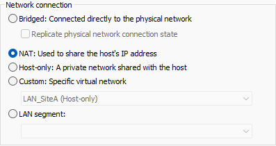
>
> Vous pouvez ensuite démarrer la **VM**.

> [!TIP]
>
> Il devrait déjà être sur le Bureau de la **VM 3CX_Site_A**.


Sur la VM **3CX_Site_A**, installer **3CXPhoneSystem** et choisir la **configuration en ligne de commandes**.


> [!WARNING] 
>
> Si vous rencontrez encore des soucis pour accéder au **serveur 3CX**, tentez de redémarrer la **VM 3CX**.
>
> En parallèle, assurez-vous de bien pouvoir communiquer en **DNS**(*nslookup*), **IP**(*ping*)…

L’interface de **3CX** est disponible sur le port **5015** à l’adresse : http://localhost:5015/ 

Suivre le guide d’installation et y **importer le fichier de configuration**.

Le **serveur 3CX** vous demandera un **certificat** et une **clé privée**. Pour ce faire, allez sur votre hôte **Debian** et exécutez la commande : 

```bash
openssl req -x509 -nodes -days 365 -newkey rsa:2048 -subj "/C=FR/ST=Ile-de-France/L=Villetaneuse/O=USPN/CN=HOSTNAME.sitea.local" -keyout private.key  -out certificate.crt
```

>  [!CAUTION]
>
> Changez le **CN** (**C**ommon **N**ame) dans la commande par votre **FQDN**.

Vous devriez retrouver dans votre répertoire personnel deux fichiers : 

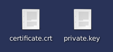

Glissez ces fichiers dans votre **VM 3CX** puis spécifiez les chemins : 

```batch
C:\Users\Administrateur\Desktop\certificate.crt
C:\Users\Administrateur\Desktop\private.key
```

> [!TIP]
>
> Si vous glissez les fichiers sur le Bureau, vous pouvez copier directement ces chemins.

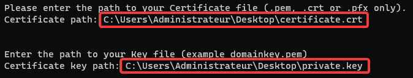


Une fois la configuration importée, nous pouvons accéder à l’interface web de **3CX**.

> [!CAUTIOn]
>
> Repassez maintenant l’interface réseau de la **VM 3CX** en **LAN_SiteA**
>
> Sur un terminal **PowerShell**, exécutez 
>
> ```batch
> ipconfig
> ipconfig /renew
> ```
>
> 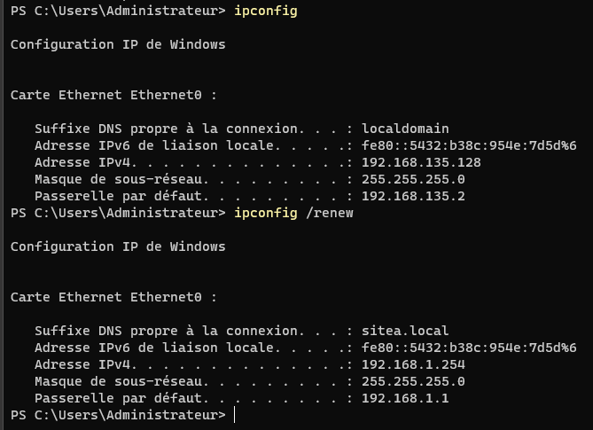
>
> Confirmez bien que **l’adresse IP** de la **VM 3CX** est bien **192.168.1.254**
>
> Notez que la **VM** n’aura plus accès à **Internet** à partir de ce moment.

Le **serveur 3CX** est maintenant opérationnel et accessible via **HTTPS**.

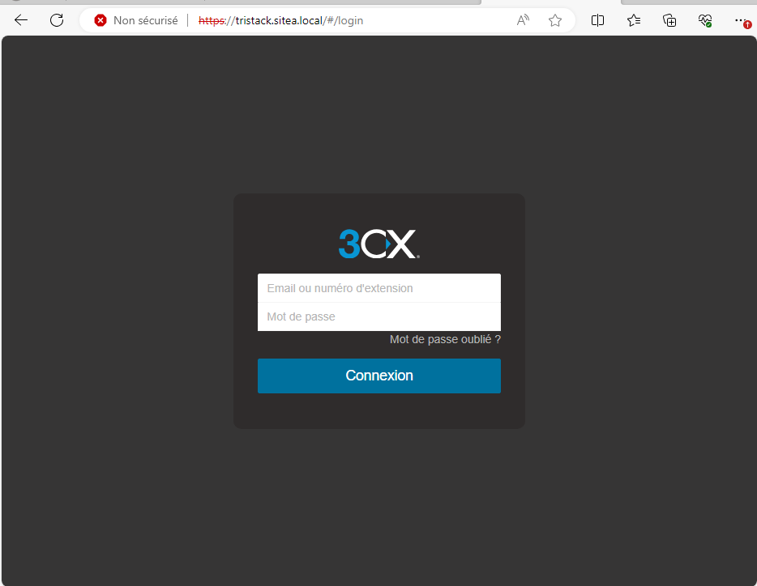

>  [!NOTE]
>
> Les identifiants sont ceux donnés lors de la création de licence.

Familiarisez-vous avec l’interface, notamment le menu **Admin**, trouvable en bas des onglets latéraux.

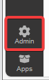

### Ajout d’extensions

Nous allons maintenant ajouter des utilisateurs.

Allez dans **Utilisateurs**, vous y verrez déjà un utilisateur (vous).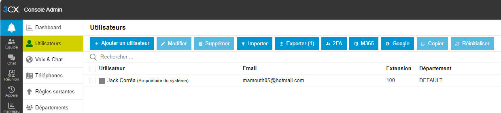

Vous pouvez en créer un via **Ajouter un utilisateur**.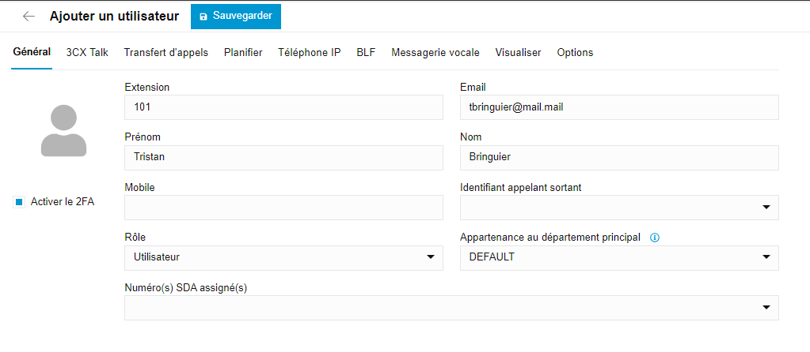

Renseignez les informations relatives à votre nouvel utilisateur.

>  [!NOTE]
>
> L’extension représente le numéro court de l’utilisateur - le numéro que les autres utilisateurs **internes** composeront.
>
> Notez que le **numéro SDA** (***S**élection **D**irecte à l’**A**rrivée*) représente le **numéro long** - le numéro que les autres utilisateurs **externes** (via un **Trunk SIP** que nous configurerons plus tard) composeront.

### Configuration du Softphone

Pour configurer un **softphone**, il faut sélectionner l’utilisateur sur **3CX** qui va l’utiliser.

Allez sur **Téléphone IP**.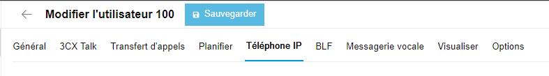

Pour configurer un **softphone**, il faut sélectionner **Je configurerai le téléphone moi-même**.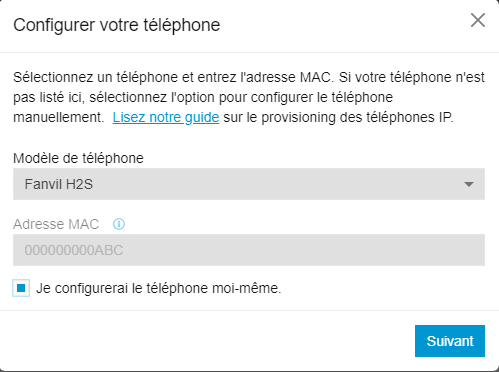

Il vous sera demandé par quelle interface le softphone doit-il communiquer avec le **serveur 3CX**, utilisez le **FQDN**.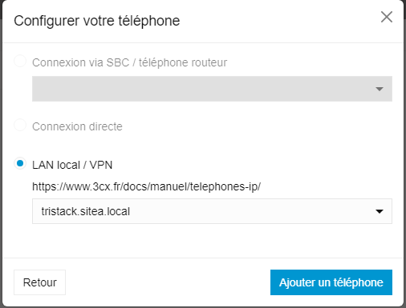


Il sera ainsi affiché les identifiants de connexion pour votre **softphone**.

> [!NOTE] 
>
> Notez ces identifiants pour la configuration du **softphone**.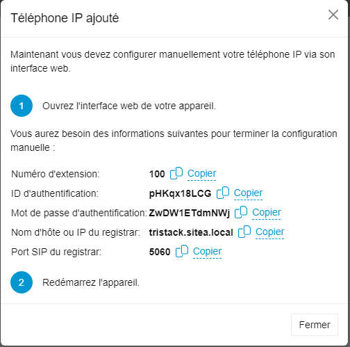

Nous allons maintenant configurer ce **profil** dans un **softphone**.

Sur la **VM Client1_Site_A**, ouvrez **3CX Phone**.

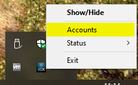

Configurez le **profil** sur **3CX Phone** comme indiqué par **3CX** : 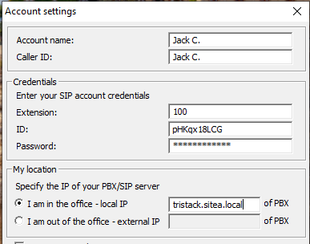

Lorsque votre **softphone** affiche **On Hook**, le profil est fonctionnel : 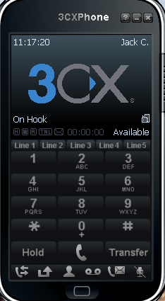

Tentez d’appeler votre messagerie au **999** pour tester.

Sur **Wireshark**, nous constatons bien l’enregistrement **SIP** du **softphone**.

> [!TIP]
>
> Utilisez le **Graphique des flux** pour visualiser le **flux SIP** ou **RTP**.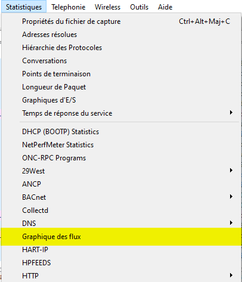
>
> Filtrez les paquets pour n’afficher que **SIP**.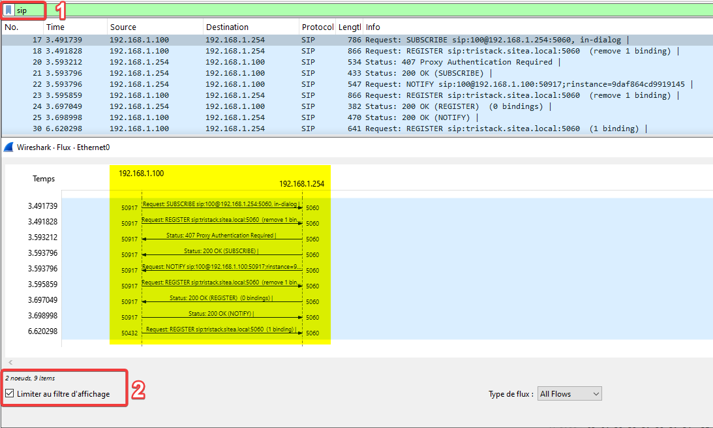

Réalisez à nouveau la procédure pour configurer un **deuxième utilisateur** et configurez le **softphone** cette fois sur la **VM Client2_Site_A**.

Tentez un appel entre les deux softphones.

### Configuration d’un Yealink T42U

Pour configurer cette fois-ci un poste physique, ici un **Yealink T42U**,

Allez dans **Utilisateurs -> Configurer un téléphone IP**

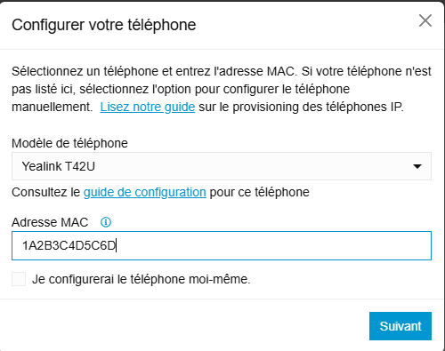

Spécifiez le modèle du poste ainsi que son **adresse MAC**.

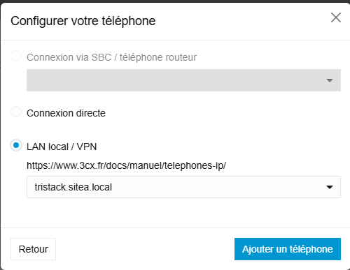

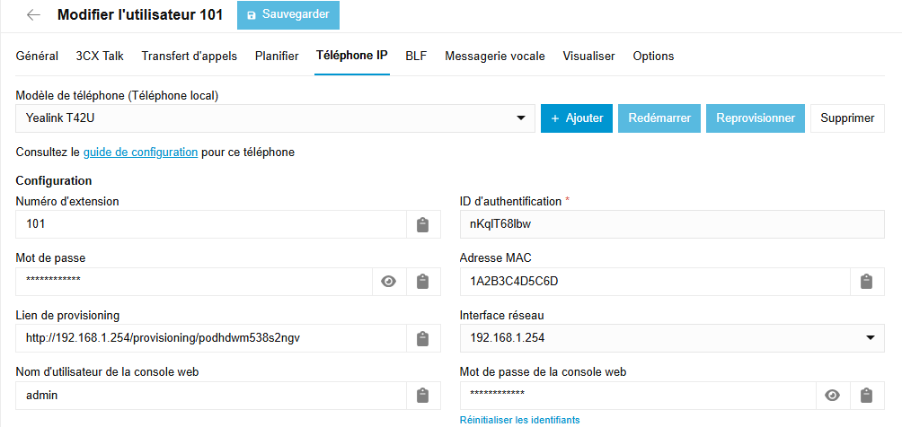

> [!CAUTION] 
>
> Pour l’**auto-provisioning**, bien spécifier **l’interface réseau** avec d’adresse IP et non le FQDN pour obtenir un lien de provisioning en **HTTP**. 
>
> *Si nous laissons en **HTTPS**, le poste renverra une erreur suite au certificat invalide.*

### Connexion d’un téléphone Yealink T42U


*Cette partie s’appuie grandement sur le [cours](https://github.com/MichelBaie/SAE303/blob/main/pdf/R316-ROM-cours.pdf) et [TPs](https://github.com/MichelBaie/SAE303/blob/main/pdf/R316-ROM-tp.pdf) de [Mr. Sami Evangelista](https://lipn.fr/~evangelista/)*

Les téléphones Yealink s’utilisent souvent en entreprise. Pour les configurer il faut :

1. **Réinitialiser** le téléphone en mode usine (maintenir OK, valider la remise à zéro).

2. Activer la ligne SIP

   dans “3 Settings -> 2 Advanced Settings -> 1 Accounts -> 1.”

   - **Display Name** : Nom de l’appelant
   - **Register Name(Auth_name)** : ID d’authentification
   - **Username** : Numéro d’extension
   - **Password** = Mot de passe SIP
   - **SIP Server 1** : 192.168.1.254

3. **Sauvegarder** et **tester** en appelant `999`.


### *Bonus - Auto-provisioning des Yealink :*

Lors du démarrage du poste, il ira consulter le **lien de provisioning** en y ajoutant en **URI** : **adresseMAC.cfg** afin qu’il récupère sa configuration auprès du **serveur 3CX**. Pour que le poste ait connaissance de ce lien de provisioning, on la renseigne dans les **options DHCP**.

Sur le **serveur DHCP**, ajoutez dans l’étendue l’**option 66** votre lien de provisioning.

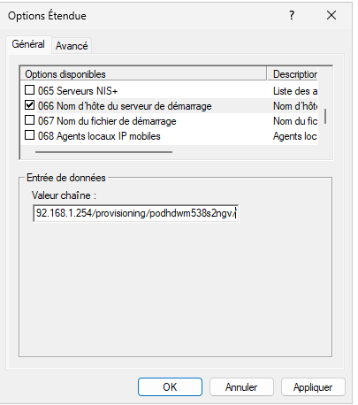

> [!CAUTION]
>
> Prenez soin de rajouter un “/” à la fin du lien de provisioning.

> [!WARNING]  
>
> À ce stade, pour tester le bon fonctionnement du provisioning, il est nécessaire de passer vos **VM** (**DHCP/DNS** et **3CX**) sur le réseau **LAN_Switch** afin d’avoir un accès par pont à l’interface de votre **PC Hôte**. Il faut évidemment tout relier via un **switch**.

N’hésitez pas à vérifier avec **Wireshark** sur votre **VM 3CX** si le poste récupère bien sa configuration en **TFTP**.

> [!NOTE] 
>
> **TFTP** (**T**rivial **F**ile Transfer **P**rotocol) utilise le port **UDP 69** et ne gère pas nativement l’authentification. D’où l’importance de le restreindre au LAN.

Si la configuration a bien été récupérée, vous devriez trouver votre poste dans un état similaire : 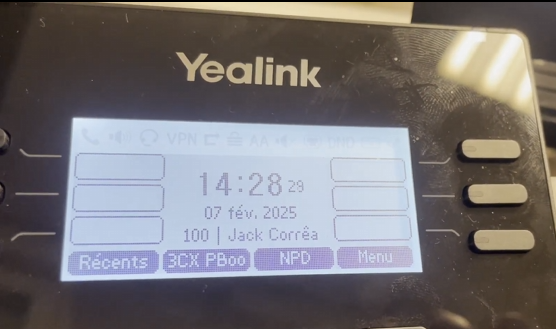


>  [!NOTE]
>
> Lorsque l’on analyse les **trames Wireshark** entre deux postes, nous constatons que le **flux RTP**, contrairement au **flux SIP** qui passe par l’**IPBX**, est direct entre les deux équipements.


## Configuration du Site B (FreePBX)

### Configuration du DHCP - DNS

Nous passons maintenant au second site. Nous allons, comme pour le Site A configurer le **serveur DHCP - DNS**.

Nous allons ici utiliser le service **dnsmasq**.

Dans la **VM FreePBX**, éditez le fichier */etc/dnsmasq.conf* avec cette configuration : 

```bash
## LAN SITE_B ##

# DHCP #
log-dhcp
dhcp-range=192.168.2.100,192.168.2.200,12h
dhcp-option=option:netmask,255.255.255.0
dhcp-option=option:router,192.168.2.1
dhcp-option=option:dns-server,192.168.2.20
dhcp-option=option:domain-name,siteb.local

dhcp-host=<MAC_de_FREEPBX>,192.168.2.254 #Sous le format : 0a:1b:2c:3d:4e:5f
dhcp-host=<MAC_de_STORMSHIELD_SITE_B>,192.168.2.1 #Sous le format : 0a:1b:2c:3d:4e:5f

# DNS #

domain-needed
bogus-priv
strict-order
domain=siteb.local
expand-hosts

address=/stormshield.siteb.local/192.168.2.1
address=/freepbx.siteb.local/192.168.2.254
address=/dns.siteb.local/192.168.2.20
address=/dhcp.siteb.local/192.168.2.20
address=/<FQDN_de_3CX>,1.2.3.1
```

Redémarrez ensuite le service **dnsmasq** :

```bash
systemctl restart dnsmasq
```


### Installation de FreePBX

**Exécutez** `sudo su -`.

**Téléchargez** et **exécutez** le script officiel :

```bash
wget https://github.com/FreePBX/sng_freepbx_Debian_install/raw/master/sng_freepbx_Debian_install.sh -O /tmp/sng_freepbx_Debian_install.sh
bash /tmp/sng_freepbx_Debian_install.sh
```

​    

1. [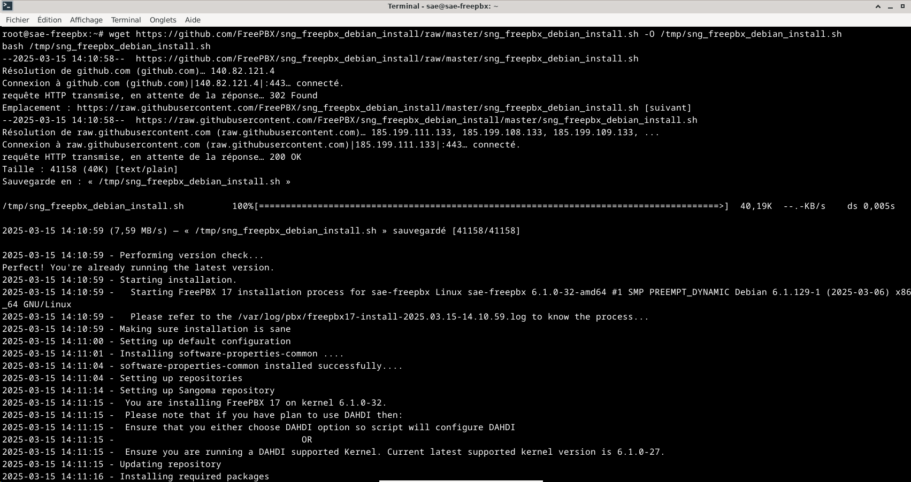](https://github.com/MichelBaie/SAE303/blob/main/img/image-20250315141143324.png)

Le script procède à l’installation d’**Asterisk** et **FreePBX**. À l’issue, une **adresse IP** sera indiquée pour accéder à l’interface d’admin.

#### Configuration initiale de FreePBX

1. **Ouvrir un navigateur web** et aller sur `http://192.168.1.254/`.

   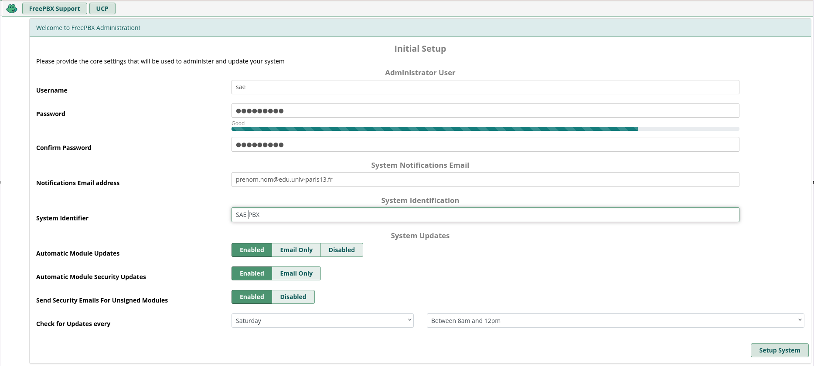

2. **Définir** les identifiants administrateur et le nom du serveur.

3. **Passer l’interface** en **Français**.

4. **Ignorer** les propositions commerciales.

5. **Appliquer** la configuration en cliquant sur “Apply Config”.

[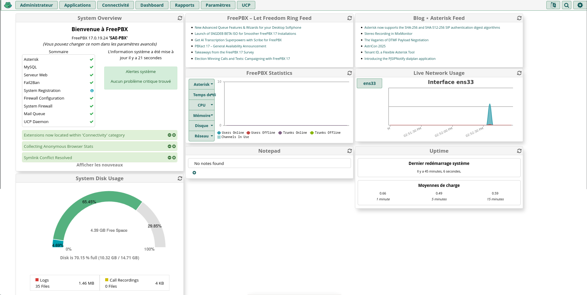](https://github.com/MichelBaie/SAE303/blob/main/img/image-20250315145408133.png)


### Création des lignes SIP

1. Dans l’interface FreePBX, aller dans **Connectivité > Postes**.

   [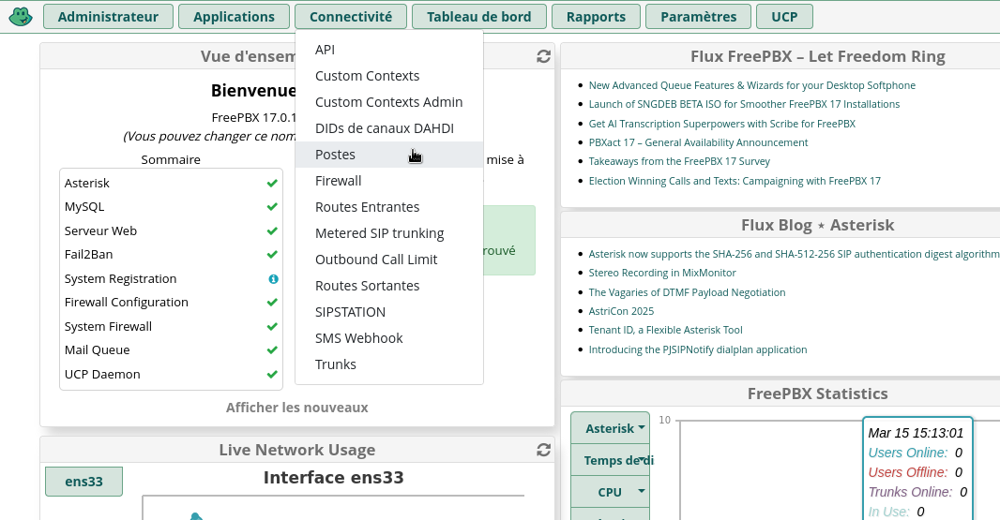](https://github.com/MichelBaie/SAE303/blob/main/img/image-20250315152623215.png)

2. **Ajouter un poste SIP [chan_pjsip]**.

   [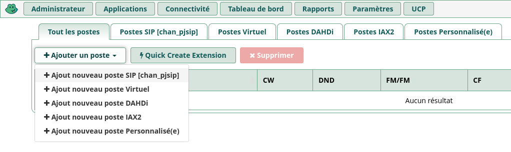](https://github.com/MichelBaie/SAE303/blob/main/img/image-20250315153348110.png)

3. **Renseigner** :

   - **Extension Utilisateur** (numéro SIP).
   - **Nom affiché** (alias).
   - **Secret** (mot de passe).

   [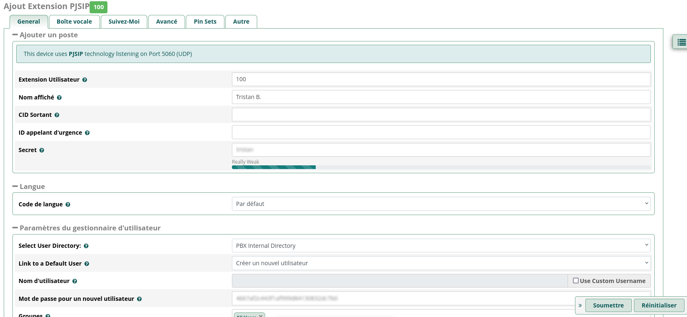](https://github.com/MichelBaie/SAE303/blob/main/img/image-20250315155008665.png)

4. **Soumettre** puis **Appliquer la configuration**.

   [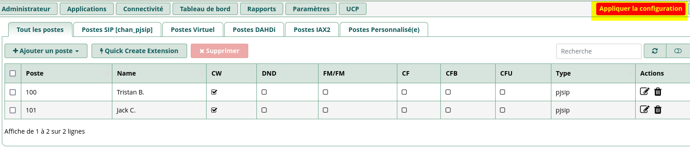](https://github.com/MichelBaie/SAE303/blob/main/img/image-20250315155456600.png)

5. **Faire de même** pour avoir **2 lignes SIP**.

### Connexion d’un client SIP (Softphone Linphone)

**Linphone** est un **softphone** libre disponible sous Linux.

1. **Installer** **Linphone** :

   ```
   sudo apt update
   sudo apt install linphone -y
   ```

   ​    

2. Lancer **Linphone** et **connecter un compte SIP** :

- **Nom d’utilisateur** = Extension SIP (ex. 100).
- **Nom d’affichage** = Alias.
- **Domaine SIP** = 192.168.1.1.
- **Mot de passe** = Secret SIP.
- **Transport** = UDP (5060).

[](https://github.com/MichelBaie/SAE303/blob/main/img/image-20250315163216375.png)

**Une fois connecté**, **Linphone** doit passer en **vert** en **haut à gauche** :

[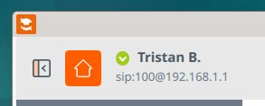](https://github.com/MichelBaie/SAE303/blob/main/img/image-20250315163711564.png)

1. **Tester** en appelant `*97` (boîte vocale d’Asterisk).

[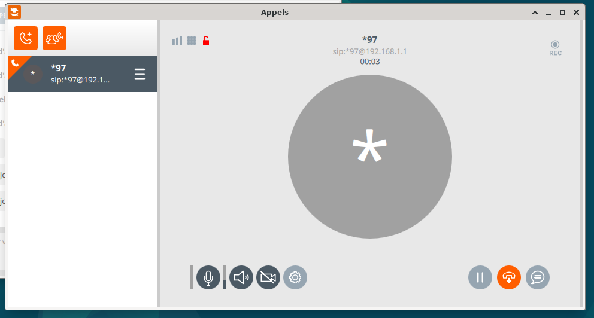](https://github.com/MichelBaie/SAE303/blob/main/img/image-20250315163850005.png)


### Connexion d’un téléphone Yealink T42U

*Cette partie s’appuie grandement sur le [cours](https://github.com/MichelBaie/SAE303/blob/main/pdf/R316-ROM-cours.pdf) et [TPs](https://github.com/MichelBaie/SAE303/blob/main/pdf/R316-ROM-tp.pdf) de [Mr. Sami Evangelista](https://lipn.fr/~evangelista/)*

Les téléphones Yealink s’utilisent souvent en entreprise. Pour les configurer il faut :

1. **Réinitialiser** le téléphone en mode usine (maintenir OK, valider la remise à zéro).

3. Activer la ligne SIP

    dans “3 Settings -> 2 Advanced Settings -> 1 Accounts -> 1.”

   - **Display Name** : Nom de l’appelant
   - **Register Name + User Name** = Numéro SIP
   - **Password** = Mot de passe SIP
   - **SIP Server 1** : 192.168.2.254

4. **Sauvegarder** et **tester** en appelant `*97`.


> [!WARNING] 
>
> Si un mauvais mot de passe SIP est saisi, **Fail2Ban** peut bannir votre IP. Sur le serveur FreePBX :  
>
> - Lister les bannissements : `fail2ban-client banned`  
> - Débannir tous : `fail2ban-client unban --all`

### *Bonus : Auto-Provisioning des Yealink*

De la même manière que pour le **Site A**, il faut configurer un serveur **TFTP** qui contiendra les fichiers de configuration dont leur noms sera leur adresse **MAC**.

Créez un dossier **/var/tftp**

```bash
mkdir /var/tftp
```

Sur la **VM DHCP_DNS_Site_B**, Ajouter à la fin du fichier de configuration de **dnsmasq** : 

```bash
# TFTP #
enable-tftp
tftp-root=/var/tftp
```

Redémarrez le service **dnsmasq** :

```bash
systemctl restart dnsmasq
```

Pour chaque téléphone, créez un fichier dont son nom sera **<MAC_du_poste>**.cfg dans **/var/tftp** dont le contenu sera ainsi :

```
#!version:1.0.0.1
account.1.enable = 1
account.1.label = <Numéro SIP>
account.1.display_name = <Nom du compte>
account.1.auth_name = <Numéro SIP>
account.1.user_name = <Numéro SIP>
account.1.pasword = <Mot de passe SIP>
account.1.sip_server.1.address = <IP du FreePBX>
lang.gui = French
```

Redémarrez le poste et testez en appelant la messagerie au ```*97```.

> [!NOTE] 
>
> Nous avions remarqué que sur **3CX**, le **flux RTP** était direct entre deux équipements du même site mais ce n’est pas le cas ici, il transite via l’**IPBX** malgré l’option par défaut **Direct Media** qui propose de communiquer en direct. Cela est due à la manière dont **FreePBX** gère le flux pour proposer des services tels que le **Call recording**, les **transferts d’appels**, etc…

## Configuration des pare-feux Stormshield

Nous allons déployer un **pare-feu Stormshield** par site.

Pour ce faire, attribuez sur les deux interfaces de la **VM Stormshield Site A** le **LAN_SiteA** et **WAN**

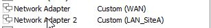

Faites de même pour le **Stormshield Site B** :

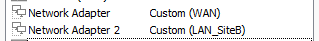

> [!WARNING] 
>
> Prenez soin à bien respecter l’ordre des interfaces telles que les captures d’écran.

>  [!CAUTIOn]
>
> Lors du démarrage des **pare-feux**, prenez soin d’avoir les **serveurs DHCP** et vérifiez que l’une des deux interfaces prend bien son **adresse IP** réservée (**192.168.(1/2).1**)
>
> De plus, vérifiez bien sur les interfaces affichées par le **terminal de la VM Stormshield** attribue bien votre **adresse IP du LAN_Site B** en **in** et l’autre  (normalement en **APIPA** (*169.254.xxx.xxx*) en **out**). Si ce n’est pas le cas, éteignez votre **VM** et intervertissez les interfaces.

L’interface de **Stormshield** est accessible via ```https://192.168.(1/2).1```.

>  [!TIP]
>
> Si vous avez du mal à accéder à l’interface de **Stormshield** mais qu’il répond bien aux pings, tentez cette **URL** : ```https://192.168.1.1/admin/admin.html```

Les identifiants sont : ```admin:<PASSWORD_DEFINI_LORS_DE_L'INSTALLATION```

### Configuration des interfaces

Configurez ainsi les interfaces **OUT **dans** **RÉSEAU -> Interfaces** :

**Site A : **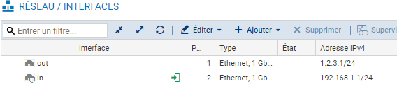

**Site B : ** 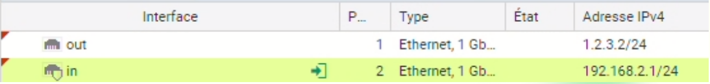


### Configuration du routage

Dans **RÉSEAU -> Routage**, configurez la route par défaut pour la diriger vers le **routeur distant**.
**Stormshield** étant un **NGFW** (**N**ext-**G**eneration **F**ire**w**all), il fonctionne avec des **objets**.

Par exemple, au lieu de définir une simple adresse IP en route par défaut, nous définissons un **objet** de type **machine**. Cet objet contient des caractéristiques telle qu’une **adresse IP**.

**Créez** un objet pour caractériser le **routeur du Site B** : 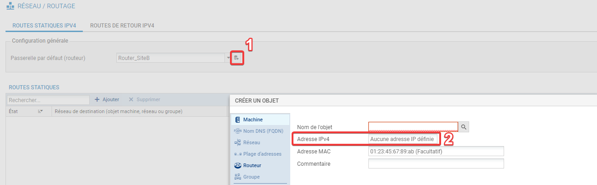


N’oubliez pas d’**appliquer** une fois ceci fait.

### Configuration du filtrage 

Dans **POLITIQUE DE SÉCURITÉ -> Filtrage et NAT**, créez des règles pour obtenir ceci.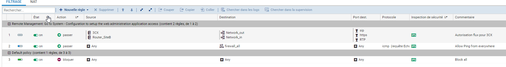

Il faudra ici créer un objet **3CX** et **RTP** (il s’agit d’une plage de ports allant de **9000** à **10999**).

Ici nous **autorisons** :

- Le flux **RTP** sortant/entrant.
- Le flux **HTTPS** sortant/entrant.
- Le flux **ICMP** sortant/entrant. (**Doit être désactivé en pratique !**)

Nous mettons maintenant en place la **translation d’adresses** (**NAT**).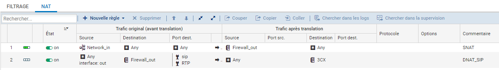

Tous les paquets **sortants** auront l’adresse IP **publique** du pare-feu. (**SNAT**)

Tous les paquets **SIP** ou **RTP** entrants seront redirigés vers le **serveur 3CX**. (**DNAT**)


Réalisez la même chose sur le **pare-feu Stormshield** du **Site B**:

**Routage par défaut : **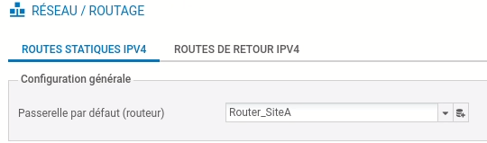

**Filtrage : **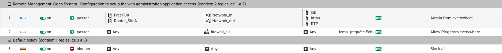

**NAT :** 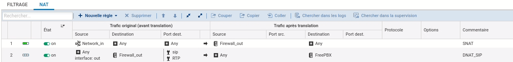


## Configuration des trunks SIP

#### Trunk sur 3CX

Pour interconnecter les deux sites, il faut configurer sur chaque **PBX** un **Trunk SIP** 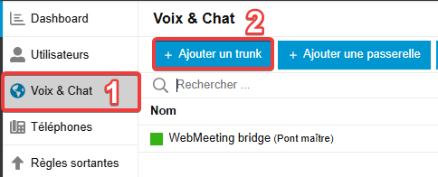

Il faut spécifier ici le **fournisseur de trunk SIP**. Il s’agit ici du serveur distant **FreePBX** donc choisissez **Generic SIP Trunk (IP Based)** : 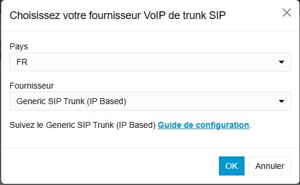

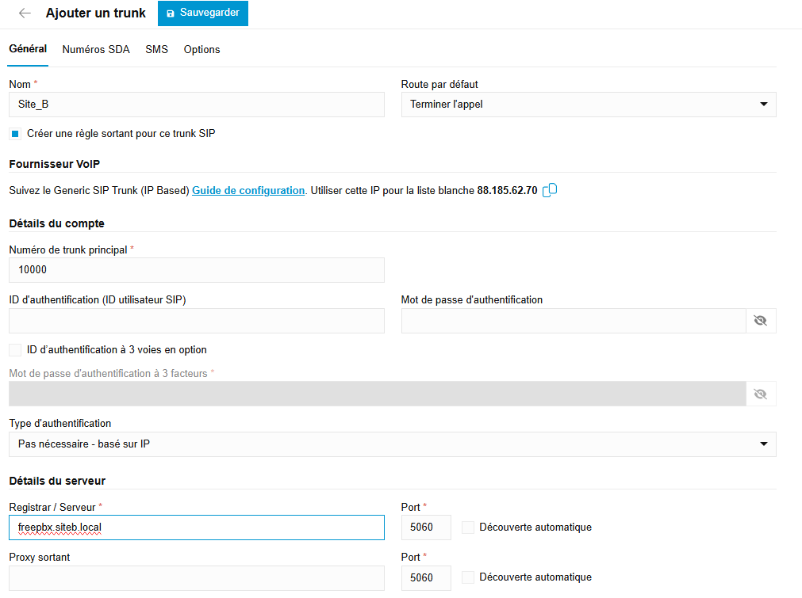

>  [!NOTE]
>
> - **Numéro de trunk principal** : Identifiant unique pour le trunk. Peut aussi servir de numéro **SDA**.
> - **Registrar / Serveur** : Adresse où le trunk se connectera.

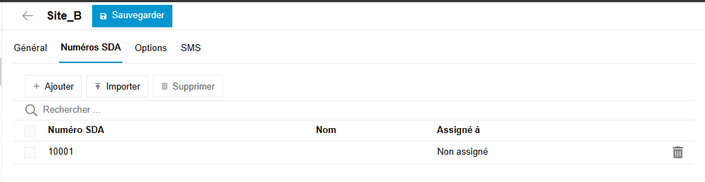

Vous pouvez également créer plusieurs **numéros SDA** que l’on peut attribuer à l’utilisateur souhaité dans **Utilisateurs -> <UTILISATEUR_SOUHAITÉ>**.

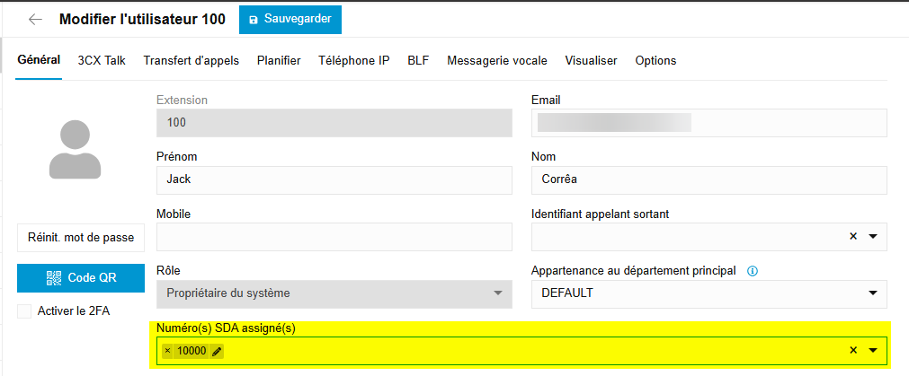

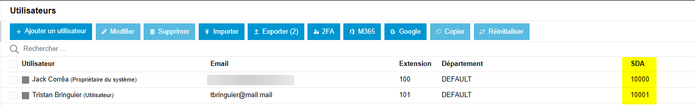

>  [!NOTE]
>
> Le **numéro de trunk principal** peut être utilisé en tant que **SDA** pour un utilisateur.

Maintenant que la connexion est établie *côté **3CX***, il faut établir des **Règles sortantes** pour définir quand sortir via le trunk.

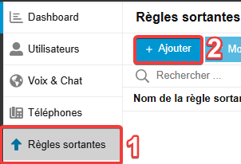

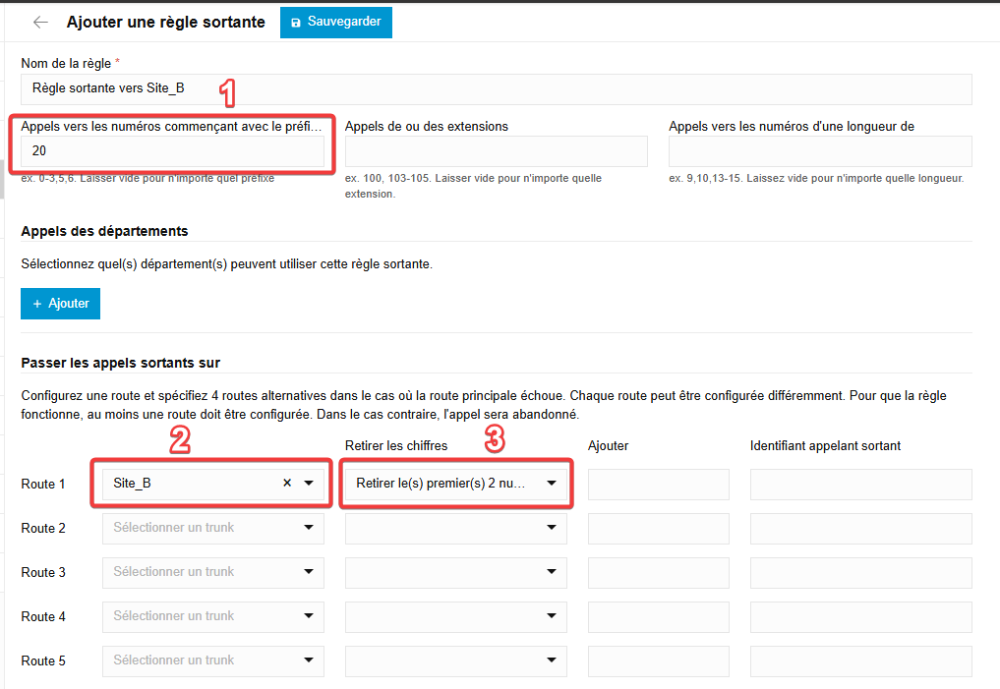

- **1** : Tous les numéros commençant par **20** appliqueront cette **règle sortante**.
- **2** : Le **trunk** à emprunter si cette règle est appliquée
- **3** : Lors de l’envoi de la requête **INVITE** (*SIP*), la règle enlèvera au numéro composé les **deux premiers chiffres**, à savoir le **”20“**.

**La configuration du trunk sur 3CX est terminée.** 

#### Trunk sur FreePBX

Avant toute choses, attribuez un **numéro SDA **(**CID Sortant**) à vos utilisateurs : 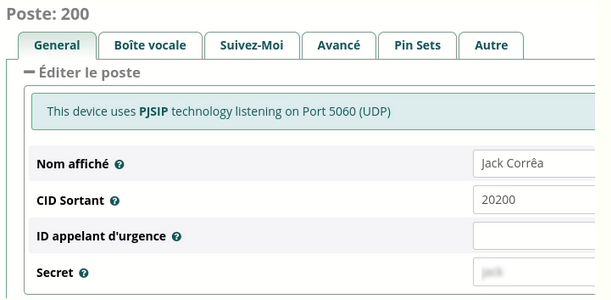


À l’instar de **3CX**, nous allons configurer le trunk sur **FreePBX**.

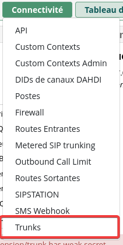

Créez un **Trunk SIP**. 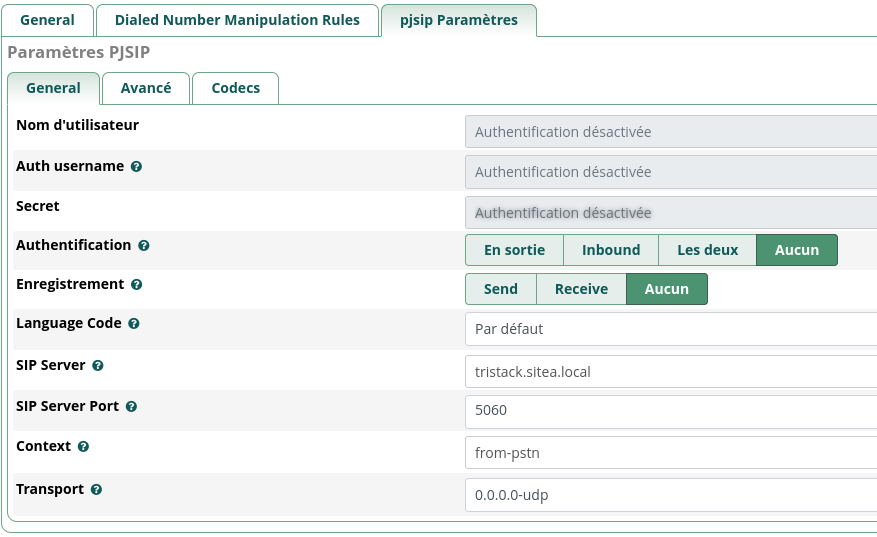

> [!TIP] 
>
> Le **Outboud CallerID** équivaut au **numéro de trunk principal** sur **3CX**.

>  [!CAUTION]
>
> N’oubliez pas de **Soumettre** puis d’**Appliquer la configuration**.

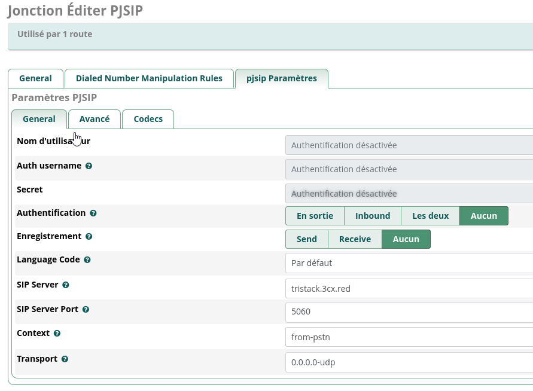

Renseignez dans **pjsip Paramètres** : 

- **Aucune authentification**
- **SIP Server** : <FQDN_de_votre_3CX>

Une fois le **trunk** configuré, il faut également savoir quand emprunter ce trunk. 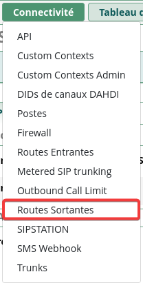

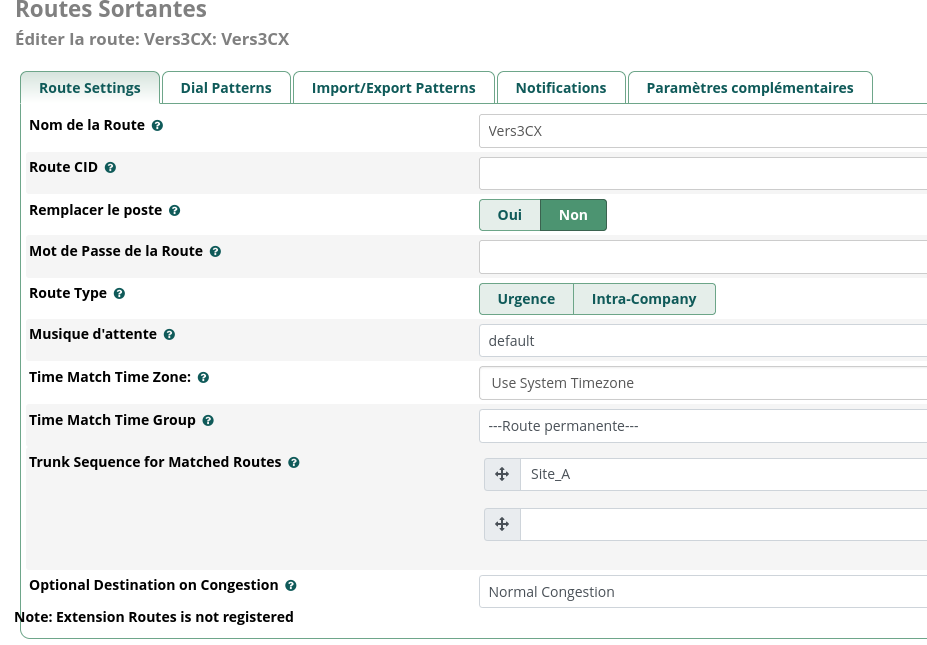

Spécifiez dans **Trunk Sequence for Matched Routes** votre trunk récemment crée. 

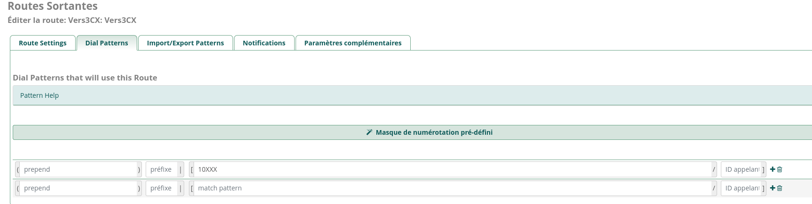

Dans **Dial Patterns**, vous pourrez renseigner le préfixe à composer pour utiliser cette règle sortante. Ici, si le numéro comporte **5 chiffres** et débute par **10**, alors la règle sera appliquée.


Il faut maintenant, lorsqu’on reçoit un appel entrant sur le **site FreePBX**, rediriger l’appel au bon endroit. Sur **3CX**, la route entrante était implicite lors de l’attribution des **SDA**, il n’y avait pas de menu dédié. Sur **FreePBX**, il y a cette fois un menu **Routes entrantes** : 

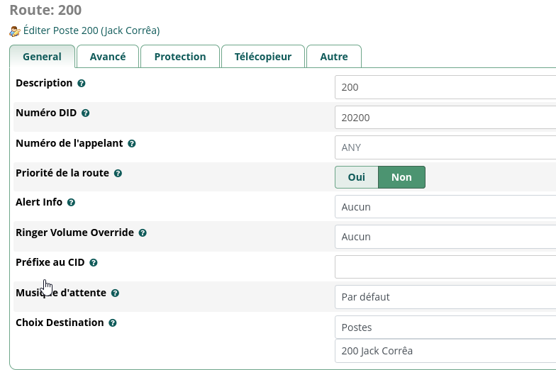

Nous renseignons dans la route : 

- **Le numéro DID** est la **SDA** reçue lors d’un appel entrant.
- **Le Choix Destination** : où rediriger l’appel.

Entre autres, lorsqu’un appel vers le 20200 est reçu d’un **trunk**, on le redirige vers le **Poste** (*utilisateur*) **200 Jack Corrêa**.

Ainsi, la connexion inter-sites est configurée.

Si vous tentez un appel, il est possible que la voix ne passe pas car **FreePBX** a une plage de ports **RTP** qui n’est pas la même que **3CX** en plus des **pare-feux** qui ne laissent passer le flux **RTP** uniquement sur la plage de **3CX**.

Pour adapter la plage de ports, allez dans **Paramètres SIP d’Asterisk** 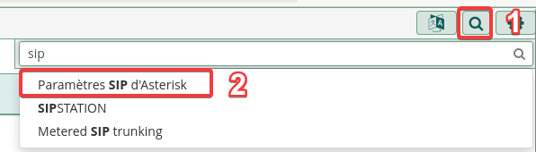

 

Profitez en pour préciser vos réseaux pour le **NAT** : 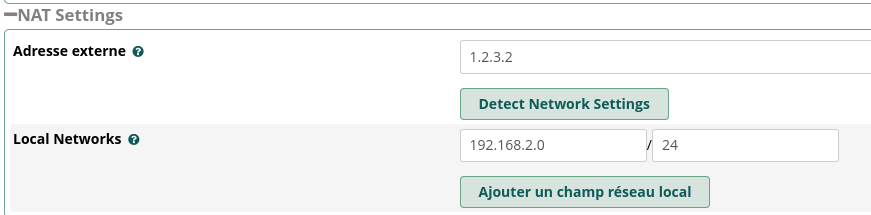


Enfin, attribuez la plage de ports **RTP** de **9000** à **10999** :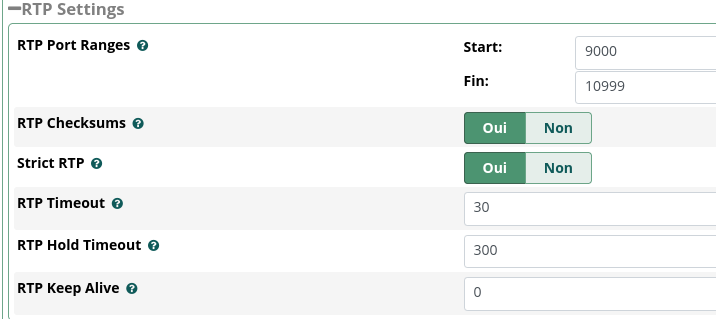

Testez un appel inter-sites, par exemple depuis le **Site A** tentez d’appeler le **20200** et inversement. 

Relevez les **trames Wireshark**, vous devriez voir le **flux SIP** et le **flux RTP** transiter du **poste** à l’**IPBX** et de l’**IPBX** au **routeur distant**.


## BONUS : Approfondissement des fonctionnalités

Maintenant que la communication inter-sites est opérationnelle, nous pouvons explorer davantage de fonctionnalités que **3CX** propose, tel que les **SVI** (**S**erveur **V**ocal **I**nteractif) ou bien les **groupements d’appels**.

Les **SVI** sont les messages pré enregistrés qui nous proposent de faire certains choix. En fonction du **DTMF** reçu par le serveur, une action sera effectuée.

Les **groupements d’appels** permettent de former des groupes d’appels. Par exemple, l’appel vers **10100** fera sonner tous les postes du groupement.

Le **client Web** proposé par **3CX** si nous n’avons pas l’accès à un softphone.


### SVI

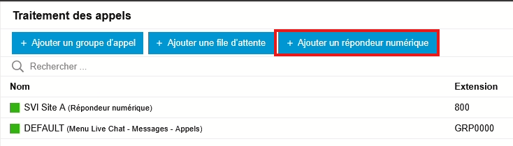

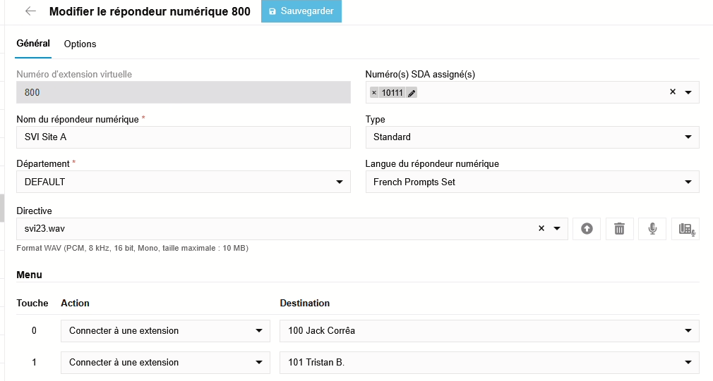

Ici, le **SVI** du **Site A** dont la **SDA** est **10111** proposera une directive (enregistrée par nos soins) et en fonction du choix (**DTMF**), l’appel sera redirigé vers l’utilisateur désiré.


### Groupements d’appels

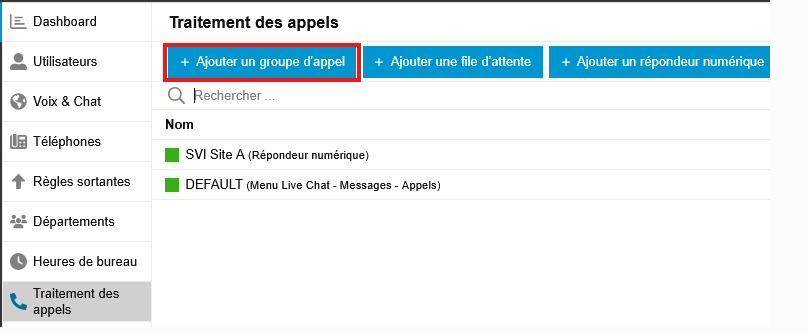

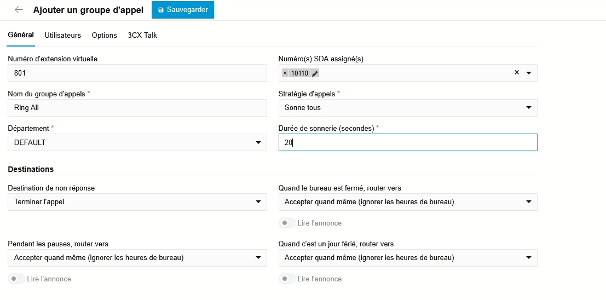

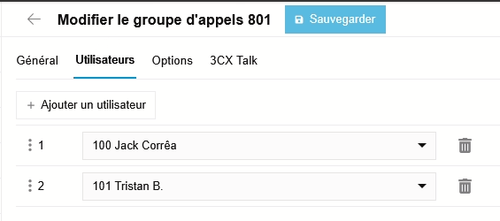

Dans ce **groupement d’appels**, tous les téléphones sonneront en même temps (**Ring All**) pendant **20 secondes**. Ainsi, lorsque le **10110** sera appelé, les utilisateurs **100** et **101** sonneront en même temps. 

Il existe plusieurs type d’appels de groupement autre que **Ring All**.

### Client Web

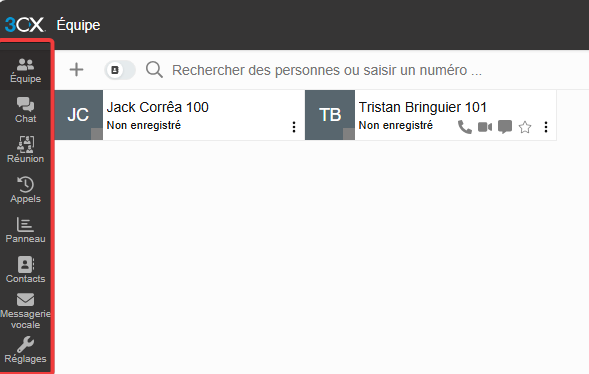

**3CX** propose différentes fonctionnalités, telle que le **Chat**, un **Annuaire** et autres. Prenez le temps de découvrir chaque fonctionnalité.


### Conclusion et vérifications finales

Dans cette SAÉ, nous avons conçu et déployé une solution de téléphonie multi-sites, comprenant :

- Un **serveur de téléphonie IP** 3CX pour la gestion des appels et des extensions internes, ainsi qu’un **serveur FreePBX** pour interconnecter les sites.
- Une **configuration de réseau virtuelle** via VMware pour simuler une infrastructure sécurisée entre les différents sites.
- La gestion de **serveurs DHCP et DNS** pour assurer la connectivité entre les machines virtuelles et les périphériques réseau.

Nous avons également exploré les principes de configuration des équipements physiques et logiciels, comme les **téléphones Yealink T42U** et les **softphones**, ainsi que les **trunks SIP** pour assurer la communication entre les différents sites.

Avant de conclure cette SAÉ, voici les points à valider :

1. Tests d’appels SIP :

   - Appels internes entre différents utilisateurs (Softphone ↔ Yealink).
   - Vérification des communications via les trunks SIP inter-sites.

2. Tests de connectivité réseau :

   - Vérification de la configuration des réseaux VMware (LAN, WAN, etc.).
   - Suivi des paquets avec Wireshark pour analyser les flux SIP et RTP.

3. Tests de configuration des pare-feux :

   - Vérification des règles de filtrage et de NAT sur les pare-feux Stormshield.

   - Test de la connectivité entre les sites à travers les pare-feux.

## Références et ressources complémentaires

- Site officiel Debian : [https://www.debian.org/](https://www.debian.org/)  
- Site officiel VMware : [https://www.vmware.com/](https://www.vmware.com/)  
- FreePBX (documentation) : [https://wiki.freepbx.org/](https://wiki.freepbx.org/)  
- Asterisk (documentation) : [https://wiki.asterisk.org/](https://wiki.asterisk.org/)  
- Linphone : [https://www.linphone.org/](https://www.linphone.org/)  
- 3CX : [https://www.3cx.com/](https://www.3cx.com/)
- Stormshield [https://www.stormshield.com/](https://www.stormshield.com/)
