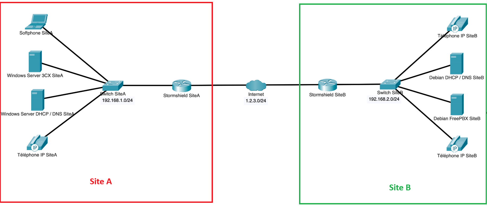
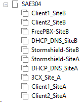
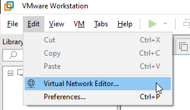
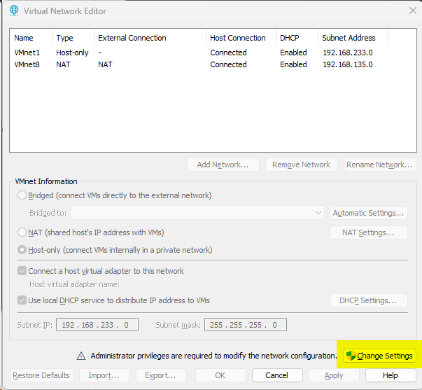
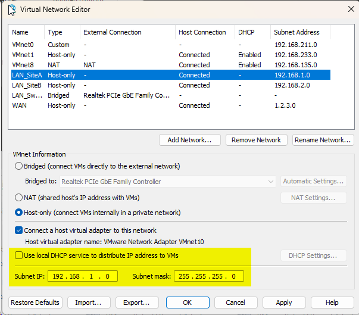
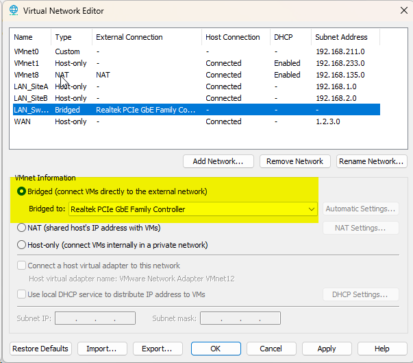

# SAE304 - Déployer un service de téléphonie multi-sites

Cette SAÉ a été réalisée dans le cadre de notre deuxième année de BUT Réseaux et Télécommunications, parcours Réseaux Opérateurs Multimédia, au sein de l’IUT de Villetaneuse.

## Introduction

Rédiger une introduction

## Pré-requis

- **VMWare Workstation Pro** : Pour créer et gérer les machines virtuelles. VMWare est désormais gratuit pour les particuliers et étudiants. Il intègre automatiquement les outils invités permettant le redimensionnement automatique de l'écran et la gestion simplifiée du presse-papier. Les installateurs pour Linux ou Windows sont disponibles sur le [CDN de VMWare](https://softwareupdate.vmware.com/cds/vmw-desktop/ws/)

## Infrastructure déployée 

Cette infrastructure représente une interconnexion entre **deux sites différents** chacun séparés par un **pare-feu Stormshield**.

Nous n’allons pas reproduire physiquement cette infrastructure.

Sur **VMWare**, nous reproduisons cette infrastructure avec cette liste de **VM (Virtual Machines / Machines virtuelles)**.

## Configuration réseau des machines virtuelles

Pour virtualiser tout cela, nous allons d’abord définir sur **VMWare** les différents réseaux.

 

Cliquer sur **Change Settings** pour pouvoir modifier les réseaux internes à **VMWare**.

Via le bouton **Add Network **(et **Rename Network** pour les renommer à souhait), créer **4 réseaux** :

- **LAN_SiteA** : Le réseau **LAN** dédié au **Site A**
- **LAN_SiteB** :  Le réseau **LAN** dédié au **Site B**
- **LAN_Switch** : Le réseau qui permettra de faire le lien entre une machine de **l’IUT** et un **switch **physique (utilisé par la suite pour faire fonctionner des téléphones physiques **Yealink T42U**).
- **WAN** : Le réseau **WAN** qui représentera **Internet** (entre les deux **pare-feux Stormshield**).

Penser à bien désactiver le service **DHCP** (nous en déploierons un par site.). Spécifiez également l’adresse du réseau sur chaque **LAN**.

Pour le **LAN_Switch**, spécifiez le réseau en **Bridged** vers l’interface réseau de votre **PC** qui sera branché sur le **switch**.

Maintenant que tous les réseaux sont configurés, nous allons configurer le **Site A**

## Configuration du Site A

Nous allons déployer un **serveur 3CX** sur le **Site A**. Avant toute chose, il faut créer une licence chez **3CX** puisqu’il s’agit d’une **solution propriétaire**.

[Créer un compte puis se connecter sur **3CX**.](https://login.3cx.com/Account/Login)

