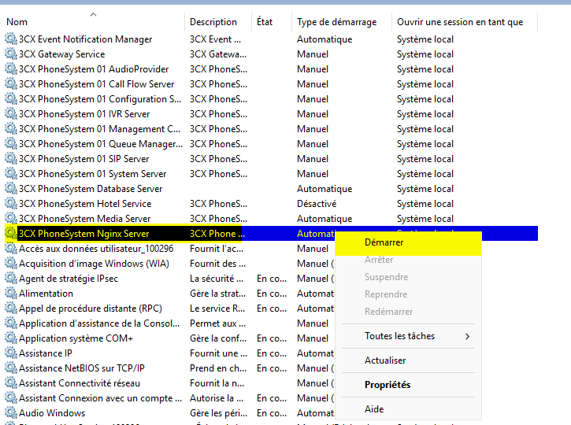

# SAE304 - Déployer un service de téléphonie multi-sites

Cette SAÉ a été réalisée dans le cadre de notre deuxième année de BUT Réseaux et Télécommunications, parcours Réseaux Opérateurs Multimédia, au sein de l’IUT de Villetaneuse.

## Introduction

Rédiger une introduction

## Pré-requis

- **VMWare Workstation Pro** : Pour créer et gérer les machines virtuelles. VMWare est désormais gratuit pour les particuliers et étudiants. Il intègre automatiquement les outils invités permettant le redimensionnement automatique de l'écran et la gestion simplifiée du presse-papier. Les installateurs pour Linux ou Windows sont disponibles sur le [CDN de VMWare](https://softwareupdate.vmware.com/cds/vmw-desktop/ws/)

## Infrastructure déployée 

Cette infrastructure représente une interconnexion entre **deux sites différents** chacun séparés par un **pare-feu Stormshield**.

Nous n’allons pas reproduire physiquement cette infrastructure.

Sur **VMWare**, nous reproduisons cette infrastructure avec cette liste de **VM (Virtual Machines / Machines virtuelles)**.

## Configuration réseau des machines virtuelles

Pour virtualiser tout cela, nous allons d’abord définir sur **VMWare** les différents réseaux.

 

Cliquer sur **Change Settings** pour pouvoir modifier les réseaux internes à **VMWare**.

Via le bouton **Add Network **(et **Rename Network** pour les renommer à souhait), créer **4 réseaux** :

- **LAN_SiteA** : Le réseau **LAN** dédié au **Site A**
- **LAN_SiteB** :  Le réseau **LAN** dédié au **Site B**
- **LAN_Switch** : Le réseau qui permettra de faire le lien entre une machine de **l’IUT** et un **switch **physique (utilisé par la suite pour faire fonctionner des téléphones physiques **Yealink T42U**).
- **WAN** : Le réseau **WAN** qui représentera **Internet** (entre les deux **pare-feux Stormshield**).

Penser à bien désactiver le service **DHCP** (nous en déploierons un par site.). Spécifier également l’adresse du réseau sur chaque **LAN**.

Pour le **LAN_Switch**, spécifiez le réseau en **Bridged** vers l’interface réseau de votre **PC** qui sera branché sur le **switch**.

Maintenant que tous les réseaux sont configurés, <u>il faut les ajouter sur les **machines virtuelles (VM)**</u>.

#### Exemple sur la VM Stormshield Site A

Ici, on aura une interface dans le réseau **WAN** et l’autre dans le **LAN_SiteA**.

## Configuration du Site A

### Configuration du DHCP

Nous allons d’abord procéder à la configuration du serveur **DHCP**.

>  [!TIP]
>
> Aller dans **VM -> Send Ctrl+Alt+Del** pour déverrouiller la **VM**.
>
> 

>  [!NOTE]
>
> Le mot de passe est **Admin01!**

Sur la VM **DHCP_DNS_SiteA**, cliquer sur **Ajouter des rôles et des fonctionnalités**.

L

Tout laisser par défaut jusqu’à **Rôles de serveurs** puis sélectionner les deux fonctionnalités **Serveur DHCP** et **Serveur DNS**.

Cliquer sur **Suivant** et laisser toutes les options par défaut.

>  [!NOTE]
>
> Si demandé, cliquer sur Finaliser la configuration **DHCP** à partir de ce menu :

Nous allons maintenant configurer le service **DHCP** : 

Cliquer droit sur **IPv4** et sélectionner **Nouvelle étendue**
Cela nous permettra de créer une **pool DHCP**.

Donner un nom à l’étendue (p. ex: **sitea.local**) : 

Attribuer la plage d’adresse **192.168.1.100 -> 192.168.1.200**. Le masque sera **255.255.255.0 (/24 CIDR)**

 

Nous allons configurer dès maintenant les **options DHCP**.

- **Routeur (passerelle par défaut) : <u>192.168.1.254</u>**
- **Domaine parent : <u>sitea.local</u>**
- **Adresse IP du serveur DNS : <u>192.168.1.20</u>**

Activer **l’étendue**.

En général, il est peu pratique qu’un **routeur/pare-feu** ou qu’un quelconque **serveur** possède une adresse IP qui varie dans le temps. Pour pallier à ce souci, nous allons **réserver** une adresse IP au **pare-feu** et au **serveur 3CX**.

Sur la **VM Stormshield** et la **VM 3CX**, aller dans les paramètres réseau et recueillir **l’adresse MAC** de chaque interface **<u>dans le réseau LAN_SiteA</u>**.

Pour créer la réservation, cliquer sur **Nouvelle réservation** sur l’onglet **Réservations** :

Renseigner le nom de la réservation, ’adresse IP que l’on veut fixer ainsi que l’adresse MAC de la machine. 

>  [!IMPORTANT]
> De la même manière, fixer l’adresse du **pare-feu Stormshield** à **192.168.1.1**.

Le service **DHCP** est maintenant opérationnel.

### Configuration du DNS

Nous allons maintenant configurer le **serveur DNS**.

Puisqu’il y a **deux sites**, il faudra donc créer **deux zones DNS**.

Cliquer sur **Nouvelle zone…**sur l’onglet **Zones de recherche directes**.

Nous allons définir une **zone principale** ayant pour nom **sitea.local**.

>  [!NOTE]
>
> Nous autorisons les **mises à jour dynamiques** afin de pouvoir mettre dynamiquement à jour la **base DNS** lors d’un **bail DHCP**.

Nous définissons de la même manière une **zone principale** ayant pour nom **siteb.local**.

Dans la zone **sitea.local**, créer **deux hôtes** avec leur adresse IP respective : 

- **VOTRE_FQDN** -> **192.168.1.254**
- **stormshield**.sitea.local -> **192.168.1.1**

Dans la zone **siteb.local**, rajouter de la même manière une entrée pour : 

- **freepbx**.siteb.local -> **1.2.3.2**
- **stormshield**.siteb.local -> **1.2.3.2**

>  [!NOTE]
>
> L’adresse IP de **freepbx**.siteb.local est la même que le **stormshield** car nous allons faire une **translation d’adresse (NAT)**.

### Configuration du serveur 3CX

Nous allons déployer un **serveur 3CX** sur le **Site A**. Avant toute chose, il faut créer une licence chez **3CX** puisqu’il s’agit d’une **solution propriétaire**.

[Créer un compte puis se connecter sur **3CX**.](https://login.3cx.com/Account/Login)

Cliquer sur **ADD SYSTEM**.

Dans notre cas, il s’agit d’une installation **On Premise**, à savoir hébergé dans notre propre environnement.

Choisir ici un **hostname**, soit un nom pour votre serveur **3CX**.

> [!WARNING]
>
> Bien sélectionner **Use Your Own SSL & FQDN Certificate** car nous ne diffuserons pas *réellement* le serveur en ligne.

Il y a ici un semblant de pré-configuration. Nous choisissons ici le nombre de chiffres dont les **numéros courts** seront composés.

>  [!NOTE] 
>
> Les **numéros courts** (ou plus couramment **extensions**) sont les numéros **internes** aux utilisateurs. 

Nous pouvons tout laisser par défaut ici.

Une fois la licence configurée, nous choisissons la plateforme sur laquelle installer le **serveur 3CX** (choisir **Windows** ici).

>  [!IMPORTANT] 
>
> Penser à bien noter le mot de passe.

Télécharger le serveur sous format **.exe** ainsi que le fichier de configuration proposé à **l’étape 3**. 

> [!TIP]
>
> Il devrait déjà être sur le Bureau de la **VM 3CX_Site_A**.

Sur la VM **3CX_Site_A**, installer le **3CXPhoneSystem** et choisir la **configuration web**.

>  [!WARNING]
>
> Il peut arriver que le **service Web** ne soit pas automatiquement démarré. Si vous ne parvenez pas à aller sur l’interface web, activez le service dans : 
>
> 

Suivre le guide d’installation puis y **importer le fichier de configuration**.

Une fois la configuration importée, nous pouvons accéder à l’interface web de **3CX** via le **FQDN** que nous avons renseigné lors de la création de la licence. 

